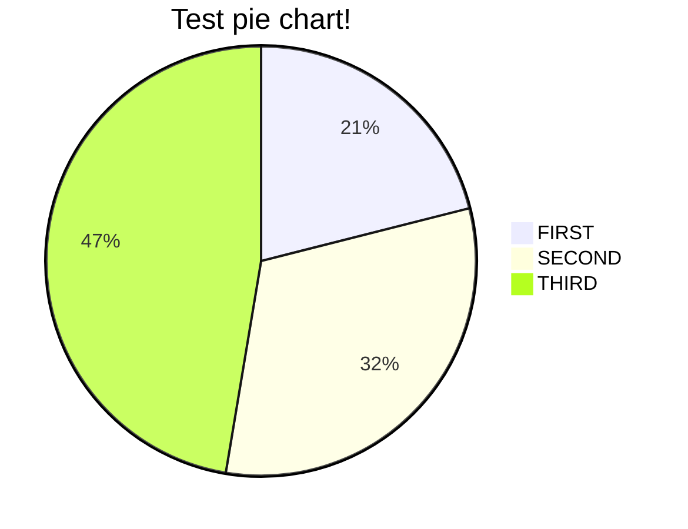

# Автоматическое исполнение скриптов в БД

## Общее описание работы

### Общее устройство

#### Подготовка системы к работе

Подготовка системы к работе заключается в создании списков задач, наполнении их задачами,
создание сценариев (связь списка задач и БД на которой он должен быть выполнен),
и планировании расписания запуска.

Подготовка системы к работе должна начинаться с создания "Списка задач" (TaskList). После чего можно приступить к
созданию "Задач" (Task). Задача должна существовать только в рамках Списка задач.

Для создания Сценария необходимо иметь в системе "Список задач" и "База Данных".

"База данных" - представляет собой описание настроек для подключения к БД, на которой будут выполняться задачи.

"Сценарий" (Scenario) - содержит в себе, как минимум, один "Список задач" и описание одной или нескольких БД.

Точное указание на то, какой список задач на какой БД должен выполняться, реализовано с помощью тегов.

После создания и отладки сценариев необходимо запланировать его запуск в работу.

#### Запуск сценария в работу и работа системы

?????

## Логика работы

### Работа по подготовке сценариев и задач

#### Пользователь

- Работа пользователя по созданию сценариев, задач, расписания запуска и т. д.
    - Начинать работу необходимо с заведения "Списка задач" (TaskList).
    - Предварительное создание сущности "Список задач" позволит перейти к созданию задач.
    - При создании задач требуется указывать список задач в который она входит.
    - Для создания
    - ***TODO*** - *детализировать процесс*.

#### Планировщик

- Запуск сценария в определённое время.
    - ***TODO*** - *детализировать процесс*.

### Работа по закрытию периода

#### Модуль "Создатель"

- Получаем сценарий из БД
- Создаём список задач на выполнение в БД в таблице TaskInstance.

#### Модуль "Стартер"

Один раз при запуске:

- Создаём коллекцию с задачами.
- Получаем из БД список задач.
- По каждой задаче, на основе данных из БД, создаём объект "TaskInstance".
- Добавляем объект в коллекцию.

Далее бесконечный цикл:

- Ищем объект TaskInstance готовый к запуску по критериям:
    - Статус - "Ready".
    - Предки отсутствуют или в статусе - "Done".
- Найденному объекту отправляем команду на выполнение и идём дальше.

Выход из бесконечного цикла: все задачи в коллекции в статусе "Done".

#### Модуль "Исполнитель"

***TODO*** - *Тут надо подумать будет ли для запуска отдельный сервис или будут только драйвера на Oracle/Shell/Lua, а
запускаться TaskInstance будет сам.*

- TaskInstance в БД устанавливает себе статус - "Starting".
    - ***TODO*** - *предусмотреть логику при одновременной работе двух приложений. Возможно он только обновляет у себя в
      коллекции статус и идентификатор Oracle.*
- TaskInstance вызывает с правильными параметрами модуль "Исполнитель".
    - Если Oracle:
        - Ждём ID запущенного процесса Oracle.
        - Модуль "Исполнитель" возвращает ID запущенного процесса Oracle.
        - Сохраняем ID запущенного процесса в БД и меняем статус на "Running".
    - Если LUA или Shell:
        - ***TODO*** - разработать процедуру по которой будем отслеживать успешное или неуспешное выполнение
          TaskInstance с типом Lua или Shell.

#### Модуль "Проверка статусов"

***TODO*** - *Возможно имеет смысл выполнять эту работу там же где и модуль "Стартер" - всё равно ходить по коллекции.*

- Проходим по коллекции с объектами TaskInstance.
- Если объект в статусе "Running" и у него заполнено поле с ID в Oracle, то даём ему команду обновить свой статус.

---

## Статусы TaskInstance в процессе работы

- Ready
- Starting
- Running
- Done

---

## Вопросы:

- Соз

### PlantUML sequence diagram

```plantuml
Alice -> Bob: Hello Bob, how are you?
Bob --> Alice: I am good thanks!
```

### Mermaid pie chart



### Run docker image

```bash
docker run -e POSTGRES_USER=petclinic -e
POSTGRES_PASSWORD=petclinic -e
POSTGRES_DB=petclinic -p 5432:5432 postgres:16.3
### docker-compose up
```

### docker-compose up

```bash
docker-compose --profile postgres up
```

### Run Spring Boot application

```bash
./mvnw spring-boot:run
```

### Run custom gradle task

`./gradlew runMyTask -Parg1=1`